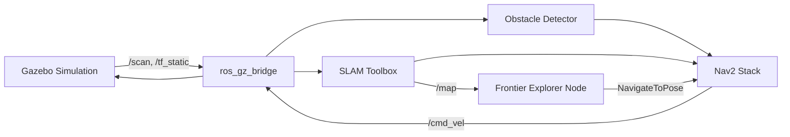

<h1 align="center">
  🤖 Autonomous Explorer ROS 2
</h1>

<p align="center">
  <b>A comprehensive, fully autonomous Gazebo-based robotic exploration stack leveraging ROS 2 and Nav2.</b>
</p>

<p align="center">
  
  
  
  
  
  
</p>

---

<!-- GIF_PLACEHOLDER -->

## 📝 Overview

Autonomous Explorer ROS 2 is an advanced robotics engineering showcase designed to dynamically map unknown indoor environments entirely without human intervention. 

Utilizing Gazebo Harmonic for strict physics simulations alongside the industry-standard ROS 2 Navigation stack (Nav2), the system safely processes 2D LiDAR and camera inputs, tracks unreachable obstacles, and computes custom algorithmic frontiers to generate the optimal exploration path across an asynchronous SLAM Occupancy Grid.

## ✨ Core Features

- **Custom Frontier Explorer**: A custom Python implementation operating OpenCV Canny edge detection algorithms over SLAM maps. Replaces simplistic random-walk approaches with cost-utility driven cluster navigation and dynamic blacklisting.
- **Robust Obstacle Fusion**: Dual-modality sensor fusion (Camera + 2D LiDAR) generating PointClouds for strict local costmap overrides, preventing blind-spot collisions.
- **QoS Mismatch Resolution**: Integrated `tf_static_republisher` explicitly solving the infamous `VOLATILE` Gazebo Transform bridging issues inherent to ROS 2 late-joiners.
- **Multi-Environment Ready**: Out-of-the-box support for distinct `warehouse` and `office` topologies.
- **1-Click Containerization**: Launch the complete stack inside isolated Docker environments flawlessly using standard `docker-compose`.

---

## 🚀 Quick Start

To reproduce the exact simulation without modifying your native Ubuntu dependencies, ensure you have [Docker and Docker Compose](https://docs.docker.com/engine/install/) installed.

```bash
git clone https://github.com/Ibrahim0899/Autonomous-Explorer-Ros-2.git
cd Autonomous-Explorer-Ros-2

# Launch the default Warehouse exploration
./scripts/run_demo.sh

# Or launch the tight Office exploration environment
./scripts/run_demo.sh --office
```

The script automatically initiates building the ROS 2 Jazzy image, starts Gazebo Harmonic, and mounts RViz 2 to X11 on your Host machine.

---

## 🏗️ System Architecture

Our navigation system strictly couples algorithm intelligence from the physical simulation through the robust `ros_gz_bridge` topology.



To dive deeper into the TF Tree or the Node execution flowchart, check out the [Architecture Documentation](docs/architecture.md).

---

## 📖 Deep Dive Documentation

For recruiters, technical leads, and collaborators evaluating the quality of these engineering decisions, we provide the following strict documentation:

1. [**Detailed Specifications (Cahier des Charges)**](docs/specifications_en.md) | [*(Version Française)*](docs/cahier_des_charges_fr.md): The functional and non-functional requirements detailing the scope, the context, and validation criteria.
2. [**Design Decisions**](docs/design_decisions.md): Detailed explanations on why *SLAM Toolbox* was chosen over Cartographer, why we built a *custom Frontier* algorithm instead of using legacy ROS 1 ports, and how the LiDAR density anomalies were resolved.
3. [**System Architecture**](docs/architecture.md): High-fidelity node mappings and transform derivations.

---

## 🗂️ Project Structure & Configuration

The package relies on strongly separated parameter declarations preventing code contamination. 

```text
├── docs/                      # Extensive engineering documentation
├── docker/                    # Isolated Jazzy builds
├── src/autonomous_explorer/
│   ├── autonomous_explorer/   # Custom CV Frontier & TF Nodes
│   ├── config/                # YAML explicit definitions
│   │   ├── nav2_params.yaml
│   │   └── slam_params.yaml
│   ├── launch/                # Component & Full System brings-up
│   ├── models/                # Explorer Bot SDF definitions
│   ├── worlds/                # Office & Warehouse Layouts
│   └── test/                  # Pytest validation suites
```

Configuration regarding loop completion size, inflation radiuses, or frontier contiguous limits are altered purely within `src/autonomous_explorer/config/*.yaml`.

---

## 🤝 Contributing

Contributions, issues, and feature requests are very welcome!
1. Fork the Project
2. Create your Feature Branch (`git checkout -b feature/AmazingFeature`)
3. Ensure CI passes locally (`black` and `flake8`)
4. Commit your Changes (`git commit -m 'feat: Add some AmazingFeature'`)
5. Push to the Branch (`git push origin feature/AmazingFeature`)
6. Open a Pull Request

## 📄 License

Distributed under the MIT License. See `LICENSE` for more information.