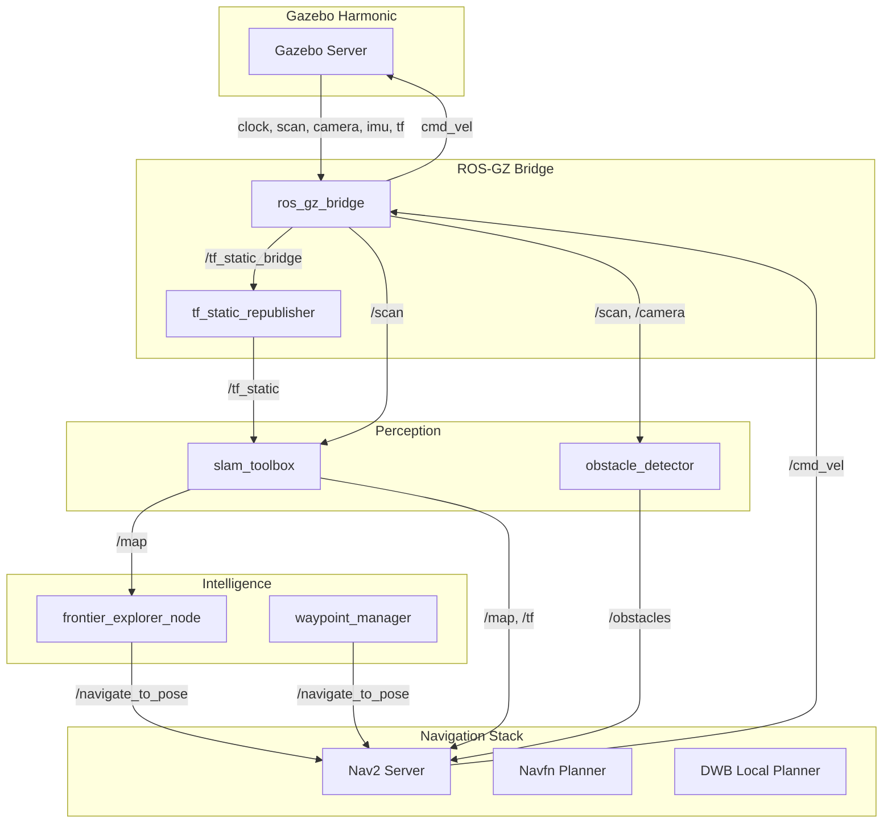
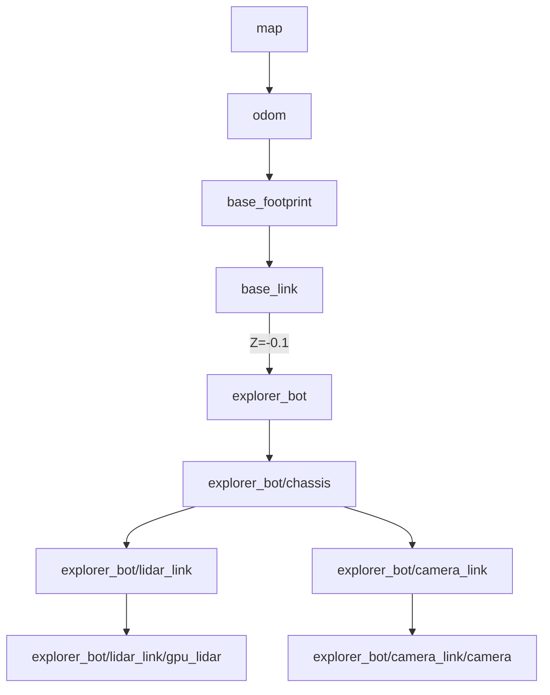

# System Architecture

This repository is built around **ROS 2 (Jazzy/Humble)** and **Gazebo Harmonic**, creating a fully decoupled autonomous stack where the robotic intelligence is agnostic to the physical simulation.

## 1. ROS 2 Computation Graph

The following Mermaid diagram outlines the primary active nodes in the system during exploration.

## 2. Component Breakdown

### Perception & Mapping
- **`slam_toolbox`**: Operates in asynchronous mapping mode. Listens to odometry and `/scan` to build a 2D occupancy grid (`/map`). Solves loops dynamically.
- **`obstacle_detector`**: Fuses 2D Laser Scan and Camera data (simulated boundary detection) to publish point clouds or discrete `MarkerArray`s representing obstacles that aren't cleanly visible in global mapping, acting as a dynamic override for local costmaps.

### Autonomy
- **`frontier_explorer_node`**: A custom implementation combining Computer Vision (Canny edge detection via OpenCV) on the `/map` grid to find contiguous "unknown" boundaries (frontiers). It scores these frontiers based on distance and information gain, clustering them to avoid micro-movements, and sends Action goals to Nav2.
- **`waypoint_manager`**: An alternative autonomy mode for patrolling known environments based on predefined YAML coordinates.

### Navigation
- **Nav2**: The heart of movement. Uses a `Global Costmap` (fed by the static `/map` from SLAM) and a `Local Costmap` (fed dynamically by `/scan` and our `obstacle_detector`). Employs DWB (Dynamic Window Approach) to smoothly avoid obstacles en route to the frontier.

## 3. TF Frame Tree

To bridge the gap between Gazebo's absolute coordinate system and ROS 2's hierarchical tracking, a specific TF tree architecture was chosen to ensure SLAM Toolbox can properly track internal sensors.

### The QoS Mismatch Resolution
A specific architectural decision was implemented regarding `tf_static`. Gazebo's Harmonic `PosePublisher` emits static frames dynamically upon entity creation but bridges them using a **VOLATILE** QoS profile. Standard ROS 2 tools (`tf2_ros`, `slam_toolbox`) strictly require **TRANSIENT_LOCAL** for `/tf_static` to support late joiners. 

The bridging is resolved by mapping Gazebo's TF to `/tf_static_bridge` and using our custom `tf_static_republisher` node to forward the payloads with correct durability.
