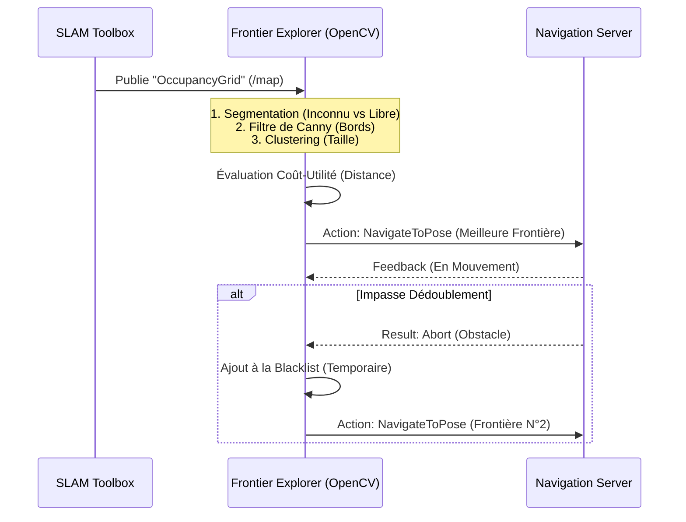

# Cahier des Charges Détaillé : Autonomous Explorer ROS 2

## 1. Contexte et Objectifs du Projet

**Projet** : Autonomous Explorer ROS 2  
**Auteur** : Ibrahima NIASSE (Ingénieur en Robotique & Informatique)  
**Objectif Principal** : Développer une pile logicielle complète en ROS 2 permettant à un robot mobile simulé (Gazebo Harmonic) de cartographier dynamiquement un espace intérieur inconnu de manière 100% autonome, tout en évitant les obstacles et en publiant une carte (Occupancy Grid) utilisable.

### 1.1 Contexte Environnemental
Ce projet vise à démontrer une maîtrise avancée de l'architecture logicielle robotique. Contrairement à une simple démonstration de téléopération, l'objectif est d'atteindre l'autonomie algorithmique stricte dans des environnements clos (entrepôts, bureaux) caractérisés par :
- Des espaces confinés (couloirs étroits).
- Des obstacles imprévus ne figurant pas sur les plans a priori.
- L'absence d'interventions de l'opérateur (pas de joystick).

## 2. Exigences Fonctionnelles (Que doit faire le système ?)

1. **Perception de l'environnement** : Le robot doit fusionner ses capteurs (LiDAR 2D haute définition et Caméra) pour détecter de manière robuste son environnement, y compris les petits obstacles risquant d'aveugler la navigation.
2. **Cartographie et Localisation Simultanées (SLAM)** : Utilisation d'un nœud capable d'opérer dynamiquement et de résoudre les boucles probabilistes au fil de l'exploration.
3. **Prise de Décision Autonome (Exploration)** : Le robot doit déterminer "où aller" ensuite pour couvrir le maximum de zone inconnue de manière intelligente (pas de marche aléatoire).
4. **Navigation Sûre** : Évitement dynamique des obstacles sans collision. Reprise sur erreur en cas d'impasse (bouclier de sécurité et comportements de récupération).

## 3. Exigences Non-Fonctionnelles (Contraintes Techniques)

- **Middleware** : ROS 2 Jazzy Jalisco.
- **Simulation Physique** : Gazebo Harmonic. Le code ROS 2 doit être totalement agnostique et séparé du simulateur via le standard `ros_gz_bridge`.
- **Langages** : Python 3.10+ (typé, standard PEP-8 strict avec `black`/`flake8`).
- **Déploiement** : L'environnement doit être conteneurisé (Docker / Docker Compose) pour offrir un temps d'exécution (`Time-To-First-Run`) de moins de 2 minutes pour tout nouveau collaborateur.

## 4. Architecture et Algorithmes

### 4.1 Exploration par Frontières (Canny Edge)
Pour éviter la surcharge cognitive du système (ex. avec les champs de potentiels), nous utilisons la stratégie de détection de frontières par vision par ordinateur appliquée à la grille de SLAM.

### 4.2 Résolution du Pontage TF (QoS)
La simulation Harmonic utilise une politique *Volatile* pour ses transformations statiques (`/tf_static`). Standard ROS 2 requiert `Transient Local`. Un nœud pont `tf_static_republisher` personnalisé a été mandaté pour relayer explicitement l'arbre TF à la sous-couche SLAM sans rupture de persistance.

## 5. Recette et Plan de Validation

La validation de la qualité logicielle (`CI/CD`) et de la robustesse algorithmique se vérifie ainsi :
- **Intégration Continue** : Tous les `commits` exécutent des tests Pytest, validations de style (`flake8`), de typage (`mypy`) via GitHub Actions.
- **Critère de Succès de Simulation** :
  - Le lancement d'un nouveau monde (ex: `office.sdf` au lieu du hangar `warehouse.sdf`) via `run_demo.sh --office` provoque une ré-adaptation parfaite.
  - Taux minimal de cartographie des espaces joignables de l'ordre de 99%, suivi du repli en arrêt terminal ou *parking* sécurisé.
