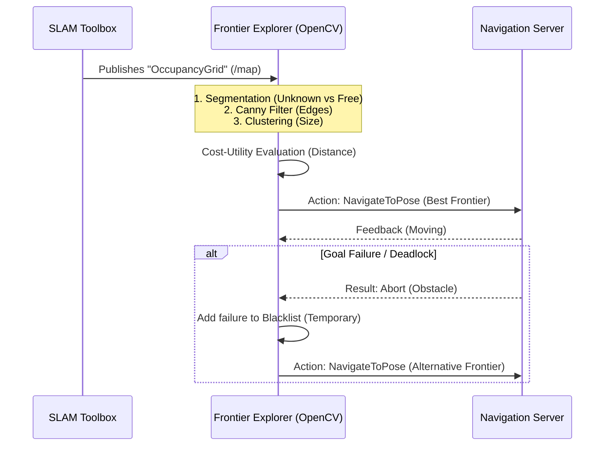

# Detailed Specifications (Cahier des Charges) : Autonomous Explorer ROS 2

## 1. Context and Project Objectives

**Project** : Autonomous Explorer ROS 2  
**Author** : Ibrahima NIASSE (Robotics & Software Engineer)  
**Main Objective** : Develop a complete ROS 2 software stack allowing a simulated mobile robot (Gazebo Harmonic) to dynamically map an unknown indoor space in a 100% autonomous manner, while avoiding obstacles and publishing a usable Occupancy Grid.

### 1.1 Environmental Context
This project aims to demonstrate advanced mastery of robotics software architecture. Unlike a simple teleoperation demonstration, the objective is to achieve strict algorithmic autonomy in enclosed environments (warehouses, offices) characterized by:
- Confined spaces (narrow corridors).
- Unforeseen obstacles not present on a priori blueprints.
- Total absence of human operator intervention (no joypad).

## 2. Functional Requirements (What must the system do?)

1. **Environmental Perception** : The robot must fuse its sensors (High-definition 2D LiDAR and Camera) to robustly detect its environment, including small obstacles that risk blinding the navigation stack.
2. **Simultaneous Localization and Mapping (SLAM)** : Utilize a node capable of operating dynamically and resolving probabilistic loop closures throughout the exploration.
3. **Autonomous Decision Making (Exploration)** : The robot must determine "where to go next" to cover the maximum unknown area intelligently (avoiding purely random walks).
4. **Safe Navigation** : Dynamic obstacle avoidance without collision. Error recovery in dead-ends (employing security shields and recovery behaviors like spinning and backing up).

## 3. Non-Functional Requirements (Technical Constraints)

- **Middleware** : ROS 2 Jazzy Jalisco.
- **Physical Simulator** : Gazebo Harmonic. The ROS 2 logic must be completely agnostic and separated from the simulator via the `ros_gz_bridge` standard.
- **Languages** : Python 3.10+ (Statically typed, strictly adhering to PEP-8 via `black`/`flake8`).
- **Deployment** : The environment must be containerized (Docker / Docker Compose) to offer a `Time-To-First-Run` execution time of under 2 minutes for any new collaborator or reviewer.

## 4. Architecture and Algorithms

### 4.1 Frontier-Based Exploration (Canny Edge)
To avoid the cognitive overhead of potential field algorithms, we utilize a Computer Vision-based frontier detection strategy applied directly to the SLAM grid.

### 4.2 Resolving the TF Bridging (QoS Mismatch)
The Harmonic simulation utilizes a *Volatile* QoS policy for its static transformations (`/tf_static`). Standard ROS 2 requires *Transient Local* durability. A custom `tf_static_republisher` bridge node was mandated to explicitly relay the TF tree to the SLAM sub-layer without persistence failure.

## 5. Testing Protocol and Validation

Validation of software quality (`CI/CD`) and algorithmic robustness is verified as follows:
- **Continuous Integration** : All `commits` automatically execute Pytest tests, style validations (`flake8`), and type checking (`mypy`) via GitHub Actions pipelines.
- **Simulation Success Criteria** :
  - Launching a brand new world (e.g., `office.sdf` instead of the warehouse `warehouse.sdf`) via `run_demo.sh --office` provokes a seamless system adaptation without code changes.
  - The minimum mapping rate of reachable spaces reaches ~99%, followed by a safe parking or terminal resting procedure.
